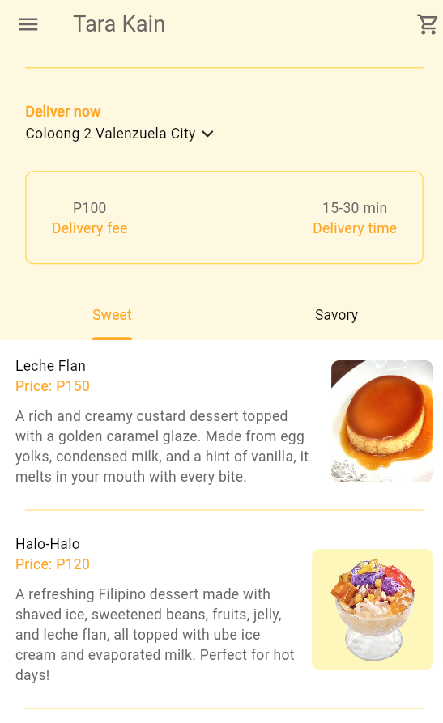

# Tara Kain

Tara Kain is a personal mobile application project that allows users to browse and explore Filipino food from the restaurant of the same name. The app provides an intuitive and engaging experience for food enthusiasts to discover dishes, customize their orders with add-ons, and simulate a complete food ordering and delivery process.

## Features

- **Browse Menu**: Explore a variety of Filipino cuisines with detailed information, including prices and available add-ons.
- **Add to Cart**: Select and add dishes to your cart for a seamless ordering experience.
- **Simulated Payment**: Experience a simulated credit card payment process with confirmation receipts.
- **Order Tracking**: Monitor your ongoing food delivery in real-time.
- **Dark/Light Mode**: Switch between dark and light themes to suit your preference.

## Purpose

This project was developed as a personal review of Flutter and mobile application development in preparation for my thesis. It helped me revisit and strengthen my understanding of key development concepts and practices.

## Learning Outcomes

Through this project, I was able to:

- **State Management**: Implement efficient state management techniques to handle dynamic data and UI updates.
- **UI/UX Design**: Design an intuitive and visually appealing interface that adapts to user preferences (e.g., dark and light modes).
- **MVVM Architecture**: Utilize the Model-View-ViewModel (MVVM) architectural pattern to separate concerns and enhance maintainability.
- **Reusable Widgets**: Create and utilize reusable widgets to streamline the development process and improve consistency across the app.

## Screenshots

Here are some screenshots of the application:

1. Main Menu:
   

2. Food Details:
   
   

3. Drawer:
   

4. Cart Summary:
   

5. Payment Simulation:
   

6. Receipt:
   

7. Dark Mode:
   

## Technologies Used

- **Flutter**: Framework used for building the application.
- **Dart**: Programming language for Flutter development.

## Installation

1. Clone the repository:
   ```bash
   git clone https://github.com/yourusername/tara-kain.git
   ```
2. Navigate to the project directory:
   ```bash
   cd tara-kain
   ```
3. Install dependencies:
   ```bash
   flutter pub get
   ```
4. Run the app:
   ```bash
   flutter run
   ```

## Future Plans

This project serves as a foundation for my upcoming thesis, where I plan to develop a more complex mobile application. Features and lessons learned from Tara Kain will significantly contribute to the success of my thesis project.

## Acknowledgments

This project is entirely self-developed with the help of youtube tutorials and serves as a personal milestone in my journey as a Bachelor of Science in Computer Science student.

---

Feel free to explore, provide feedback, or adapt this project for your learning and development.
